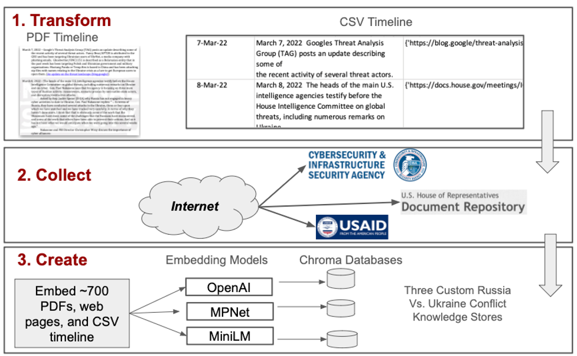
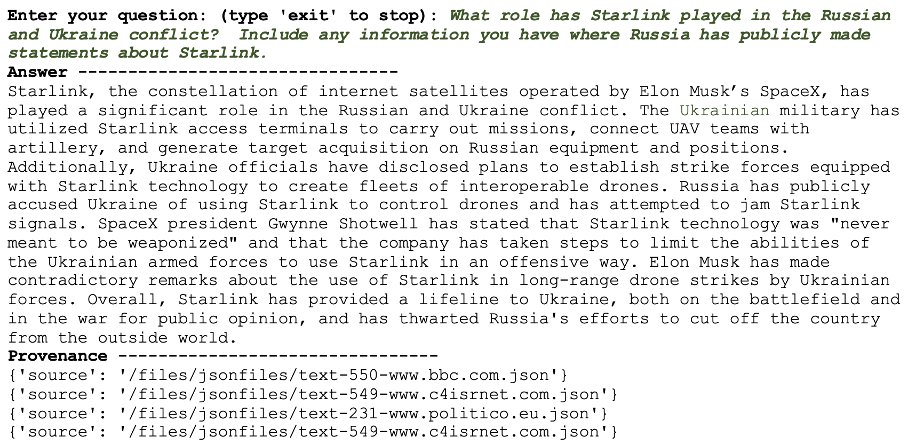
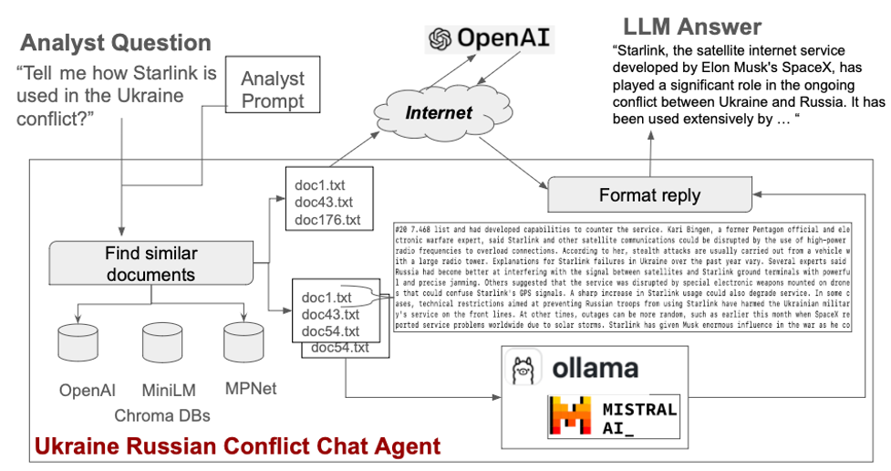
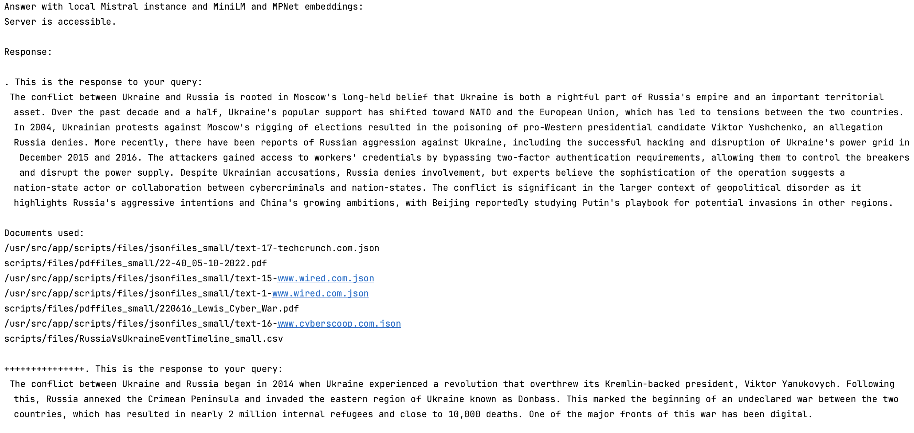

# Russian Ukraine Conflict Knowledge Store #

This project is focused on creation of a custom knowledge store about the Russian and Ukraine conflict.  It serves three audiences:

- Those with an interest in the Russian and Ukraine conflict,
- Those who want to learn how to create a custom knowledge store relevant to a heterogeneous set of documents otherwise knowns as a RAG (Retrieval-Augmented Generation) pipeline,
- Those who want to learn how to run a large language model locally - right on their own laptop with Ollama,
- Those who want to know "How good are LLMs at auto-generating code?"

It uses a 240 page chronology of the major events of the conflict as the knowledge store core.  This open source document was developed by researchers at the National Security Archives.  It is the best open source chronology of the conflict's events through May 2023.  Critically, it contains links to the original articles where the event summaries were distilled from.  Here is a link to the PDF chronology document: 

[Cyber Vault Ukraine Timeline](https://nsarchive.gwu.edu/document/29562-cyber-vault-ukraine-timeline)

The project ingests this file and all files it points to via hyperlinks.  This leads to a knowledge store with close to 700 documents in total.

## Creating the Document Set for the Knowledge Store ##

The project transforms the PDF into a knowledge base in three discrete steps depicted in the following figure.



**1. Transform:**
This step takes the PDF and transforms it into a comma separated values (CSV) file. This required creating Python code to identify the dates, the narratives, and collecting the URLs for the linked documents from the PDF itself.  This is an all too common and tedious task for analysts; reverse engineering a PDF file back to its original form to extract critical content.  LLMs assisted greatly with this task and recommend to the Canisius researchers code to perform the intricate translation.  The CSV provides the cornerstone for the knowledge base.  It also provides the complete listing of URLs to the vast set of amplifying documents.

**2. Collect:**
This step downloads the amplifying documents referenced in the chronology. This is another familiar step for analysts; assembly of a document corpus to answer questions about a domain.  Researchers used LLMs to create the Python code that visits each URL and downloads the target document. PDFs are stored in their raw form. Web pages are stored as text extraction representations wrapped in JSON.  Roughly 1/3 of the 1,223 unique URLs are not fruitful as they are either no longer active or are pay wall blocked.

**3. Create:**
The final step involves creating a knowledge store for the LLM-backed chat agent. We use a RAG pipeline to implement the LLM-backed chat agent. A RAG implementation embeds a document corpus within the context of an existing LLM model. It does not train a new LLM model on the document set; rather, it expands an existing LLM model with a new document set. This approach is satisfactory for our implementation because the vast majority of the text in the collected documents consists of well-written English narratives. It aligns well with the linguistic constructs present in the training data of the two LLMs we have chosen to serve as our chat bots. The next section explains what embedding a document corpus entails.

## Installation and Running the Code ##

The code is a Python project.  

**Step 1. Install requirements.txt**

The project contains a requirements.txt.  For those who are unfamiliar - here are some directions on how to use a requirements file to manage libray usage by a Python project:

https://chat.openai.com/share/7b1848d5-b89a-4e99-8b6b-e65238aea72c

**Step 2. Update config file**

The `scripts` folder holds the project source code. The folder holds a file named `config.ini`.  It provides the following variables the user needs to configure.  Some of the default values assume the user creates a folder within the `scripts` folder named `files`.  All directory realted values in the default configuration are relative to this directory.

- `NSA_PDF_TIMELINE` = Path to Ukraine timeline PDF file
- `NSA_CSV_LOCATION` = Path to CSV file that the timeline PDF is translated into.
- `PDFS_FOLDER` = Folder that holds the downloaded PDF files.
- `JSONS_FOLDER` = Folder that holds the web page text extractions wrapped in JSON.
- `OPENAI_API_KEY` = An Open AI key.  Be careful with it!  Don't share it!
- `CHROMA_DB_PERSIST` = Folder that holds the chroma db (used for OpenAI embeddings only.  MPNet and MiniLM use a ChromaDB container with collections persisted across restarts).  
- `OPENAI_EMBEDDING_MODEL` = OpenAI embedding model to use.
- `CHROMA_DB_MPNET_MODEL_NAME` = The MPNet embedding model to use [3].
- `CHROMA_DB_MINILM_MODEL_NAME` = The MiniLM embedding model to use [4].

**Step 3. Create events timeline CSV file**

The scripts folder contains a file named `Driver.py`.  This script drives creation of the CSV file, downloads the files and web pages links point to, and creates the knowledge store.

To run the CSV creation, simply enable and run the function at bottom of `Driver.py`  named `createCSV` (commented with #1 in the file).  The config variables `NSA_PDF_TIMELINE` and `NSA_CSV_LOCATION` must be set.

The function will generate a file named `RussiaVsUkraineEventTimeline.csv`.  It will hold a CSV version of the PDF.  The file will be located in the `files` folder if the default configuration values are used.

**Step 4. Download resources for supporting URLs**

The timeline CSV file holds pointers to over a thousand links that are web pages or PDF documents with supplemental and more detailed information of the events in the timeline.  These represent the perfect content for a knowledge store.

The python class `Driver.py` contains instances of `PdfDownloader` and `HtmlDownloader`.  These are logically named and will download the PDFs and web pages the URLs point to.  The `config.ini` file contains two vairables: 

- `PDFS_FOLDER` = Folder that holds the downloaded PDF files.
- `JSONS_FOLDER` = Folder that holds the web page text extractions wrapped in JSON.

Here, the values point to two folders.  The default configuration assumes the folders are created inside the `files` folder like so: `scripts/files/pdffiles`.  Users are free to set the download location to wherever they wish.

A note about downloads.  Some sites no longer function and the original web pages and PDFs result in 404 errors.  Some web pages are paywalled blocks.  But a reasonable percentage (70%) are available for download with relevant content in tact.

HTML pages are scraped using BeautifulSoup.  Here, the implementation is basic.  No effort has been made to fine tune and strip out text exclusively relative to the Russian vs. Ukraine conflict.  

To run the download scripts, simply enable #2 and #3 in the script `Driver.py`.

**Step 5. Creating the Knowledge Store**

This is the goal of the project; creation of a knowledge store.   The folder `knowledge_store_examples` contains a series of progressively complex examples of question and answering.  

To run these demos the user will need a OpenAI key.  The key will need to be set in the config file (do not share it!).  It is accessed like so in the code:

`os.environ['OPENAI_API_KEY'] = openai_key`

Here are descriptions of each of the question and answering examples:

***Text as Context Only***

To run this demo, enabled #4 in the `Driver.py` class.

`TextAsContext.py` is the simplest case.  Here, each row of the `RussiaVsUkraineEventTimeline.csv` file is turned into a LangChain Document.  The first 100 rows of the document are used as context when a question is submitted to an LLM backed Question and Answering chain.  In a nutshell this is what happens:

- The script takes the first 100 rows and sends them as LangChain Documents to the ChatGPT 3.5 model,
- ChatGPT then uses that text (the 100 documents) as context to answer the question.  

The drawback to this approach is that the number of tokens that may be sent as context is capped (4,096 tokens maximum, for example).  That means a user cannot send the complete `RussiaVsUkraineEventTimeline.csv` file as context even if the user wanted to!  What a terrible limitation!

This example has a hard coded question for the purposes of demonstration: _How does Russia attempt to control the Internet?_

_Note: The OpenAI Cost Using ChatGPT 3.5 to run this demo:  Fraction of a cent_

***Vector Store as Context Unpersisted***

To run this demo, enabled #5 in the `Driver.py` class.

How does the user overcome the problem with sending tokens to ChatGPT to use as context?  One way is to create a custom, local knowledge store.  `VectorStoreAsContextUnpersisted.py` shows how to index the `RussianVsUkraineEventTimeline.csv` file using the OpenAI embeddings and a ChromaDB vector store.  What is happens is the following:

- Each row of `RussianVsUkraineEventTimeline.csv` is turned into a LangChain Document, 
- Each document is embedded in a vector space using the default OpenAI embeddings.  This makes it searchable as though it were another document indexed by ChatGPT.  

The user can now ask a question of the local knowledge store.  It is hardcoded with the question: _What is the IT Army?_

The (clear) drawback of this approach are the fact that the ChromaDB needs to be recreated each time.  This itself takes time and money!  The solution that is needed is one that persists the generated embedding.  See the next demo class!

_Note: The OpenAI Cost Using ChatGPT 3.5 to run this demo:  A few cents if that_

***Vector Store as Context Persisted OpenAI Variant***

To run this demo, enable #6 in the `Driver.py` class.

The class `VectorStoreAsContextPersisted.py` creates embeddings for all the PDF files, the HTML extractions, and the `RussiaVsUkraineEventTimeline.csv`.  This means the user will have a much larger ChromaDB that will cost slightly more to generate.  

The first time it is run, a ChromaDB will be created in a folder called `files\chromadb` (assuming the user uses the config defaults).  The database will take some time to generate.  Subsequent runs will use this persisted ChromaDatabase as the knowledge store for a question answering.

The image shows the running script.  



Here, a user has entered a question.  It is a typical LLM backed question / answering system.  The context of the question helps to define the expressiveness of the answer.  The figure belows shows what happens.



Also note the section at bottom that lists provenance.  It includes the list of documents from the ChromaDB that it used to answer the question.  This is a critical piece of the puzzle - Does the LLM report where its answer came from?  In the example image above, 3 distinct documents were used to create the answer.

_Note: The OpenAI Cost Using ChatGPT 3.5 to run this demo:  Under a dollar.  It is a onetime expense as once the ChromaDB is created, it is persisted._

***Vector Store as Context Persisted MPNet and MiniLM Variant***

To run this demo, enable #6 in the `Driver.py` class.  However, you need to do a few items first.  This is an involved
demo - part of the inspiration taken from a post by Matt Brazel on medium.com [1].

The figure above that shows how the chat agent fields questions provides a picture of what is happening.  In a nutshell:

1. **Run ChromaDB** - A docker container for Chroma is required.  So, you need a Docker engine running.  The specific command used to deploy the container is this:
```
docker run -d -p 8000:8000 -v chromadb_data:/app/data -e PERSIST_DIRECTORY=/app/data chromadb/chroma
```
It will run the container, open up port 8000 so your localhost may connect, and then uses the PERSIST_DIRECTORY environment variable directive.  Without this, you will lose any collection you create and persist in the ChromaDB docker instance.  So, if you create a collection and shut down the ChromaDB container - that collection is gone as well!  Note, for this project creating the ChromaDB collection for MPNet took over 7 hours on a decent Mac!  You probably want to persist it.
2. **Run Ollama** - You will need to install and run Ollama [2].  Follow Matt's article to show you how [1].  The key is to have Ollama serving and listening for requests and running the Mistral LLM.  Note, this could be in a Docker container as well.
3. **Name the ChromaDB Collections to be Created** Next, you will need to set the names for the collections you will create in the ChromaDB.  In the cofiguration file these are:
- `CHROMA_DB_MPNET_COLLECTION_NAME` = 'mpnet'
- `CHROMA_DB_MINILM_COLLECTION_NAME` = 'minilm'
Feel free to leave it named these, or change them to whatever you want.
4. **Build the RAG Server Docker Container**  Next, you need to build the Docker container that will run the RAG server to send questions to Mistral LLM.  You may need to study out how this works.  Matt's article [1] is required reading before starting this step.  Here is what will happen:
- The Docker container will be built.
- The script rag.py will be run as the second to last step.  This script is critically important.  It reads in the files for the Russian and Ukraine timeline, and uses the MiniLM and MPNet embedding functions to embed them.  It stores the results as a collection in the ChromaDB.  Note - this takes a while to run!  You may wish to create folders with smaller sample sizes (say 5 or 10 files and a timeline CSV file of 50 rows) to make sure it works.  This can be accomplished by editing the config file.  Be patient, if you are new to Docker the learning curve will be moderate.  However, you will learn a lot along the way.  The command to build the RAG server is:
```docker build -t rag . > build_results.txt 2>&1```
Here the build console output is sent to build_results.txt.  If you tail this file, you can see any errors that arise and fix them quickly.
5. **Run the RAG Server** - If the container builds successfully, it means the ChromaDB has been populated as well.  Next, run the container with this command:
```docker run -p 5001:5000 rag```
This will start the container that hosts the RAG server and make it available to the localhost - in the example above on port 5001.
6. **Run Driver.py**  If steps 1 - 5 are completed and the two Docker containers are running, the chat agent will send any question asked to OpenAI's model using its embdeddings, and then twice to Mistral via Ollama - one using the MiniLM embeddings and then again using the MPNet embeddings.  You now have three answers to your question to compare!

Here is an example of the output when the Mistral LLM is asked to discuss the Russian and Ukraine conflict.  Two replies come back, one using the MPNet embeddings and the other the MiniLM embeddings:



Success - you are running the pipeline completely locally!  You now have at your fingertips a pipeline and LLM chat agent on par with ChatGPT 4.0!

## Use of Automated Code for Data Assembly & Cleaning ##

Most of the code found in this repository was auto-generated using LLMs ChatGPT, Claude, Ollama, and the LangChain chat agent. It is (_very_) safe to say that this project would not exist without these incredibly useful tools.  The matrix below lists how LLMs were used to auto-generate significant portions of the application's business logic:

| Task                                                                                                                             | Description of how LLM Assisted                                                                                                                                                                    |
|----------------------------------------------------------------------------------------------------------------------------------|----------------------------------------------------------------------------------------------------------------------------------------------------------------------------------------------------|
| Extract text from a PDF                                                                                                          | LLMs offered up multiple libraries in Python capable of text extraction from PDF.  Some are better than others.  The LLM's re-engineered this code until the best extraction library routine was identified. |
| Extract links from a PDF                                                                                                         | This is a pretty hard task to do for those unfamiliar with PDF manipulation.  It was much faster to have the LLM offer a solution than to search Google.                                           |
| Explain how a URL hyperlink in a PDF file may be bound to its text mention in the doucment                                       | This is is an extremely hard task!  A 20 minute discussion with an LLM described how it works.  It would have not been fun or easy to find this soultion using Goolge exclusively.                 |
| Provide regexes to find 30 different date patterns                                                                               | This task would have taken quite a long time to do manually.  Online regex tools would been consulted to test developed solutions.  The LLMs simply gave back solutions with most working on the intial request. |          
| Download the supporting PDF files and HTML pages                                                                                 | A relatively easy task - but why not let the LLM do it!                                                                                                                                            |
| Multi-thread downloads in Python                                                                                                 | Multi-threading is a moderately difficult task.  The LLM nailed how to do it in Python out of the box.                                                                                             |
| Extract text from HTML pages                                                                                                     | A moderately difficult task.  This led to many conversations about what was and was not possible.  The solution is not perfect - but text extraction from web pages rarely is.                     |
| Embedding the PDF documents, the timeline doucment, and web page extractions in a vector space for an LLM model, like Chat GPT 3 | The LangChain chat agent was good at describing the different apporaches to embedding documents using existing language models.                                                                    |
| Create a chromaDB for a question/answering (Q/A) chat agent                                                                      | There are so many new libraries and technologies with scant documentation.  After much cajoling - the LangChain chat agent expalined how to create and use the Chroma db as part of a Q/A agent!   |

One note about the genreated source code; there are no unit tests.    The project was initially created as a proof of concept.  Like so many proof of concept implementations, unit tests were not on the top of the list of tasks.  However, it is trivial to mandate the LLM generate unit tests along with the code it creates.  In the future there will be unit tests.

## Next Steps ##

There are many.  A short list of next steps inlcudes:

- Adding interview transciptions to the knowledge store.  This is critical.  Many of the articles mention speeches or interviews.  It would be trivially easy to use OpenAI's Whisper to translate the audio to text and then provide those as additional documents.
- Adding Langchain Agents and Templates. This would be focused toward development of a soup-to-nuts report authoring capability.  It is more advanced and would require question chaining and developing different sections of a report.
- Adding an abiity to grow the timeline.  This is certainly in the 'more to come' section for sure!  There is a path to getting the LLMs to search content and keep the timeline updated.

## References ##

- [1] Link to article: https://medium.com/@mbrazel/open-source-self-hosted-rag-llm-server-with-chromadb-docker-ollama-7e6c6913da7a
- [2] Link to Ollama: https://github.com/ollama/ollama
- [3] Link to MPNet paper: https://arxiv.org/abs/2004.09297
- [4] Link to MiniLM paper: https://arxiv.org/abs/2002.10957